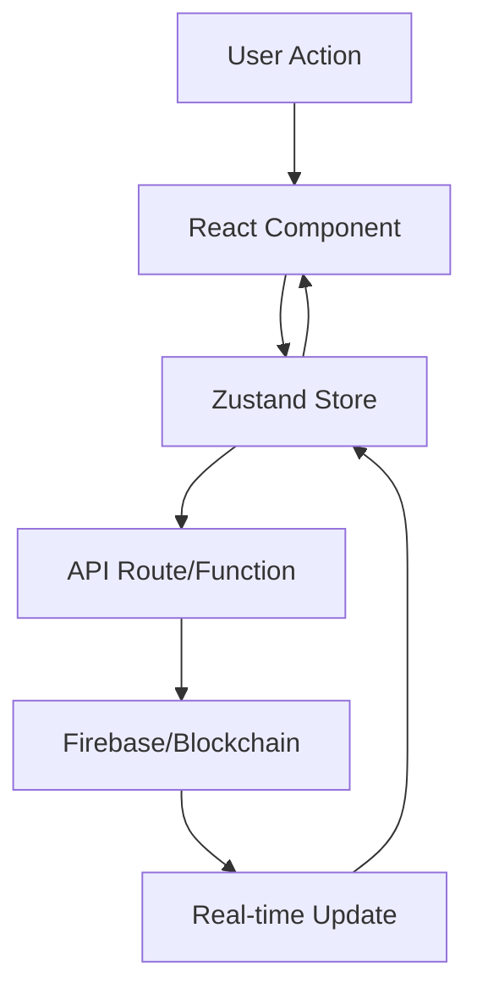

# OPERATOR UPLIFT - EXECUTIVE SUMMARY

## Complete Technical Documentation Package for Engineering Team

---

# 📋 DOCUMENTATION OVERVIEW

This documentation package provides **comprehensive technical specifications** for the Operator Uplift platform, enabling your 4-person engineering team to fully understand the current implementation and successfully migrate to a modern React/Next.js architecture.

## Documentation Contents

| Document | Purpose | Key Information |
|----------|---------|-----------------|
| **00_EXECUTIVE_SUMMARY.md** | This document - overview and guide | Navigation, key insights, action items |
| **01_PROJECT_OVERVIEW.md** | Complete project architecture | Tech stack, features, data flow |
| **02_MODAL_ARCHITECTURE.md** | 15+ modal components | Structure, functions, migration strategy |
| **03_JAVASCRIPT_FUNCTIONS.md** | 99+ JavaScript functions | Complete function inventory with details |
| **04_API_ENDPOINTS.md** | 30+ API endpoints | Netlify functions, request/response formats |
| **05_FIREBASE_FIRESTORE.md** | Database architecture | Collections, security rules, validation |
| **06_AI_INTEGRATION.md** | 7 AI provider integrations | DeepSeek, OpenAI, Claude, Gemini, etc. |
| **07_GAMIFICATION_SYSTEMS.md** | Complete gamification mechanics | XP, levels, achievements, rewards |
| **08_WEB3_SOLANA_INTEGRATION.md** | Blockchain integration | Phantom wallet, $UPLIFT token, burns |
| **09_CSS_STYLING_PATTERNS.md** | Design system | Colors, components, animations |
| **10_PWA_SERVICE_WORKER.md** | Progressive Web App | Offline, caching, push notifications |
| **11_REACT_NEXTJS_MIGRATION.md** | Migration guide | Step-by-step React/Next.js conversion |
| **12_ENVIRONMENT_CONFIGURATION.md** | Configuration & deployment | Environment variables, CI/CD |

---

# 🎯 KEY INSIGHTS FOR ENGINEERING TEAM

## 1. Current Architecture
- **Monolithic SPA**: Single `app.html` file with 3,746 lines
- **Inline Everything**: All JavaScript, CSS, and HTML in one file
- **Direct DOM Manipulation**: No component framework
- **localStorage State**: Client-side persistence
- **Netlify Functions**: Serverless backend

## 2. Critical Features to Preserve
- **Onboarding Assessment**: AI-powered personality quiz
- **Focus Timer**: Gamified productivity tracking
- **Achievement System**: 50+ unlockable achievements
- **Token Economy**: Points → $UPLIFT token conversion
- **AI Chat**: Multi-provider AI integration
- **Social Features**: Leaderboards, community posts
- **Wallet Integration**: Phantom wallet for Web3

## 3. Technical Debt Areas
- **No Component Reusability**: Duplicate code throughout
- **State Management**: Scattered across global variables
- **Error Handling**: Inconsistent patterns
- **Type Safety**: No TypeScript
- **Testing**: Minimal test coverage
- **Build Process**: Manual concatenation

## 4. Migration Priorities

### Phase 1: Foundation (Week 1)
- Set up Next.js project with TypeScript
- Configure Tailwind CSS
- Implement authentication context
- Set up Firebase integration

### Phase 2: Core Components (Week 2)
- Convert modals to Radix UI components
- Build reusable card components
- Implement navigation system
- Create layout components

### Phase 3: Feature Migration (Weeks 3-4)
- Migrate focus timer with hooks
- Port achievement system
- Convert gamification mechanics
- Implement AI chat interface

### Phase 4: Backend Integration (Week 5)
- Convert Netlify functions to API routes
- Implement Firestore hooks
- Set up real-time subscriptions
- Configure Web3 integration

### Phase 5: Testing & Optimization (Week 6)
- Write comprehensive tests
- Optimize performance
- Implement error boundaries
- Add monitoring

---

# 💡 CRITICAL IMPLEMENTATION NOTES

## State Management Strategy
```typescript
// Recommended Zustand store structure
stores/
├── userStore.ts        // User profile, XP, level
├── sessionStore.ts     // Focus sessions, timers
├── gameStore.ts        // Achievements, rewards
├── walletStore.ts      // Web3, token balances
└── aiStore.ts          // AI chat, personality
```

## Component Architecture
```typescript
// Component hierarchy
components/
├── layouts/
│   ├── AppLayout.tsx
│   └── AuthLayout.tsx
├── features/
│   ├── focus/
│   ├── goals/
│   ├── ai-chat/
│   └── wallet/
├── ui/
│   ├── Button.tsx
│   ├── Card.tsx
│   ├── Modal.tsx
│   └── Input.tsx
└── shared/
    ├── LoadingStates.tsx
    └── ErrorBoundary.tsx
```

## Data Flow Architecture


---

# 🚨 HIGH-PRIORITY ITEMS

## Security Concerns
1. **API Keys**: Currently exposed in client-side code
2. **Rate Limiting**: Minimal protection against abuse
3. **Input Validation**: Inconsistent sanitization
4. **CORS**: Overly permissive configuration

## Performance Issues
1. **Bundle Size**: 3.7MB single HTML file
2. **No Code Splitting**: Everything loads at once
3. **Unoptimized Images**: No lazy loading
4. **Memory Leaks**: Event listeners not cleaned up

## UX Improvements Needed
1. **Loading States**: Add skeleton screens
2. **Error Messages**: Implement user-friendly errors
3. **Mobile Experience**: Fix responsive issues
4. **Accessibility**: Add ARIA labels, keyboard navigation

---

# 📊 METRICS & MONITORING

## Current Analytics
- Google Analytics 4
- Facebook Pixel
- Custom event tracking

## Recommended Additions
- Sentry for error tracking
- Vercel Analytics for performance
- PostHog for product analytics
- Datadog for infrastructure

---

# 🔧 DEVELOPMENT WORKFLOW

## Recommended Tools
```json
{
  "editor": "VS Code",
  "formatting": "Prettier",
  "linting": "ESLint",
  "testing": "Jest + React Testing Library",
  "e2e": "Cypress or Playwright",
  "git-hooks": "Husky + lint-staged",
  "ci-cd": "GitHub Actions + Vercel"
}
```

## Git Strategy
```bash
main
├── develop
│   ├── feature/auth-system
│   ├── feature/focus-timer
│   └── feature/ai-chat
├── staging
└── production
```

---

# 📚 ADDITIONAL RESOURCES

## External Documentation
- [Firebase Documentation](https://firebase.google.com/docs)
- [Next.js Documentation](https://nextjs.org/docs)
- [Solana Web3.js](https://solana-labs.github.io/solana-web3.js/)
- [Radix UI](https://www.radix-ui.com/)
- [Tailwind CSS](https://tailwindcss.com/docs)

## Code Repositories
- **Current Production**: `operator-uplift/`
- **Version 3 Migration**: `Version3_Organized_Migration/`
- **Backup Versions**: Multiple timestamped backups

## Contact Points
- **Product Owner**: Define requirements
- **UX Designer**: Clarify design decisions
- **DevOps**: Infrastructure access
- **QA Team**: Testing requirements

---

# ✅ ACTION ITEMS FOR TEAM

## Immediate Actions (Day 1)
1. [ ] Review all documentation files
2. [ ] Set up local development environment
3. [ ] Access Firebase console
4. [ ] Clone repository and run locally
5. [ ] Identify team member specializations

## Week 1 Goals
1. [ ] Complete project setup
2. [ ] Establish coding standards
3. [ ] Create component library
4. [ ] Set up CI/CD pipeline
5. [ ] Begin authentication migration

## Success Criteria
- **Performance**: Core Web Vitals all green
- **Accessibility**: WCAG 2.1 AA compliant
- **Security**: OWASP Top 10 addressed
- **Testing**: >80% code coverage
- **Documentation**: Complete API documentation

---

# 🎯 FINAL RECOMMENDATIONS

## Architecture Decisions
1. **Use App Router**: Next.js 14 App Router for better performance
2. **Server Components**: Leverage RSC where possible
3. **Edge Functions**: Use edge runtime for API routes
4. **Incremental Migration**: Port feature by feature
5. **Feature Flags**: Enable gradual rollout

## Technology Choices
1. **State**: Zustand over Redux (simpler)
2. **Styling**: Tailwind + CSS Modules
3. **Forms**: React Hook Form + Zod
4. **Tables**: TanStack Table
5. **Charts**: Recharts or Chart.js

## Timeline Estimate
- **MVP**: 4 weeks (core features)
- **Full Feature Parity**: 6-8 weeks
- **Optimization & Polish**: 2 weeks
- **Total**: 8-10 weeks

---

**Document Version**: 1.0.0
**Last Updated**: August 2025
**Prepared For**: 4-Person Full-Stack Engineering Team
**Project**: Operator Uplift - React/Next.js Migration

---

## 📝 Notes

This documentation package represents a complete technical analysis of the Operator Uplift platform. Every function, feature, and integration has been documented with implementation details and migration strategies.

The engineering team now has everything needed to:
1. Understand the current system architecture
2. Identify technical debt and improvement areas
3. Plan and execute the migration to React/Next.js
4. Maintain feature parity while modernizing
5. Implement best practices and standards

**Total Documentation**: 12 comprehensive documents covering 10,000+ lines of technical specifications, code examples, and implementation guides.

---

**Good luck with the migration! 🚀**
